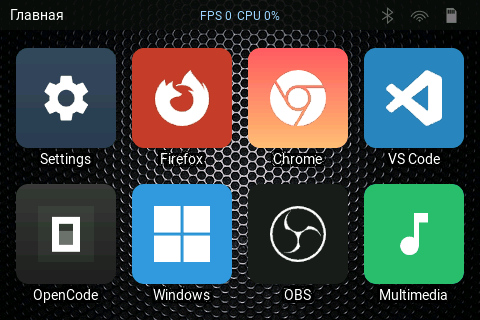
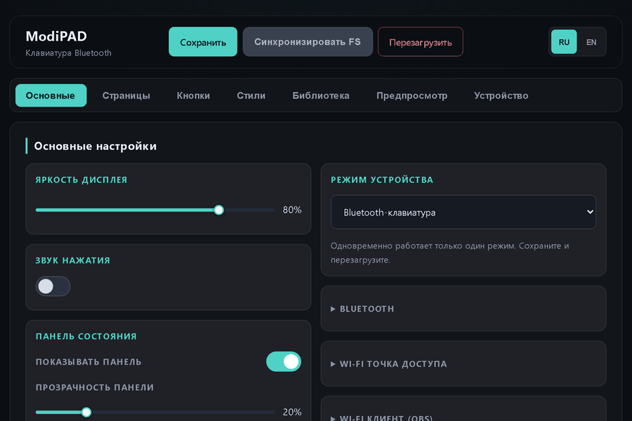

<h1 align="center">ModiPAD</h1>

  <b>A configurable touch keyboard on the ESP32‑S3</b> — build pages and buttons in the browser,
  send hotkeys / text / macros over Bluetooth LE, and control OBS Studio.

  
  

  <a href="README.md"><b>English</b></a> · <a href="README_RUS.md">Русский</a> · <a href="docs/screenshots/README.md">Screenshots</a>

  
   
  

A touch keyboard on the **ESP32-S3** with the **JC3248W535EN** 3.5-inch touch display (480x320, **AXS15231B** QSPI panel + capacitive touch). It has JSON-driven touch pages, runtime backgrounds, an OBS Studio client, a full web configurator and OTA updates.

> **Read the "Critical invariants" section in [Architecture](docs/architecture.md#7-critical-invariants-do-not-break) before changing any driver, the flush path, the memory placement or the task/core layout.** Those rules are load-bearing; breaking one of them has already caused hard, hard-to-debug UI freezes.

## Table of contents
1. [Overview](#1-overview)
2. [Supported device](#2-supported-device)
3. [Features](#3-features)
4. [Screenshots](#4-screenshots)
5. [Getting started](#5-getting-started)
6. [Firmware & updates](#6-firmware--updates)
7. [Languages](#7-languages)
8. [start.bat menu](#8-startbat-menu)
9. [Documentation](#9-documentation)
10. [Contributing](#10-contributing)
11. [License](#11-license)
12. [Acknowledgments](#12-acknowledgments)

---

## 1. Overview

ModiPAD turns a single ESP32-S3 touch display into a configurable touch keyboard. Its touch buttons send keyboard shortcuts, text, macros, multimedia keys and OBS Studio actions. The whole layout is one JSON file that you edit in the built-in web configurator. The device can also work as a Wi-Fi access point, an OBS remote and a Bluetooth LE HID keyboard. No host application is needed — configure it from any browser.

The firmware is an **ESP-IDF 5.3.1** application built with PlatformIO. The AXS15231B display/touch drivers and the LVGL port originate from the vendor reference projects and have been adapted for ESP-IDF instead of Arduino. The current release is **5.3.8** (`MODIPAD_FIRMWARE_VERSION` in `src/config.h`).

---

## 2. Supported device

The project is designed and optimised for one device: the **JC3248W535EN** module (a 3.5-inch IPS touch board on the ESP32-S3). No external parts are required.

| Part | Details |
|------|---------|
| Module | **JC3248W535EN** — 3.5-inch IPS display board |
| MCU | ESP32-S3, dual-core Xtensa LX7 @ 240 MHz, Wi-Fi + BLE 5 |
| Flash | 16 MB, QIO @ 80 MHz |
| PSRAM | 8 MB octal (OPI) @ 80 MHz, ECC on |
| Display | 3.5-inch IPS, 320x480 native (portrait), **AXS15231B** controller, QSPI (4 data lines); the UI is shown rotated to 480x320 landscape |
| Touch | Capacitive, **AXS15231B** touch controller, I2C (address `0x3B`, 400 kHz) |
| Backlight | GPIO1, PWM brightness control |
| USB | Native ESP32-S3 USB-Serial-JTAG (flashing and logs, appears as a COM port) |
| Storage | microSD via SDMMC 1-bit (optional, for extra media) |

The screen is a 3.5-inch IPS panel (controller AXS15231B) addressed over QSPI. Because the panel is full-refresh-only it is driven with `full_refresh = 1`, and the landscape view is produced by software rotation (see [Architecture](docs/architecture.md) 1.4). The full pinout and wiring are in [Architecture](docs/architecture.md) 11.

---

## 3. Features

- **Configurable touch pages.** Each page is a grid of touch buttons. A button can show an icon or text.
- **Button actions.** A button can send a hotkey, text, a macro or a multimedia key. It can also send an OBS Studio command, or open another page or the settings.
- **Touch control.** Tap a button to press it. Swipe left/right to change page. Swipe down for the main page. Swipe up to dim the screen.
- **Bluetooth output.** The device sends keys as a Bluetooth LE HID keyboard, including multimedia keys.
- **Wi-Fi.** It can work as a Wi-Fi access point for the web configurator, or as a Wi-Fi client to reach OBS Studio.
- **On-device settings.** Radio mode, brightness, key sound, Wi-Fi, OBS, sleep timeout, config backup and firmware update.
- **Web configurator.** Edit pages and buttons, manage images, preview the result, view logs, back up the config and upload firmware.
- **Duplicate pages and styles.** In the web configurator, **Duplicate** makes a full copy of a page (the Main page included) and of a style; the copy's name gets a trailing `1`.
- **Problems screen.** The device **Settings → Problems** tile lists boot-time diagnostics: SD card missing/nearly full, a damaged config and missing files (the missing-file check covers the internal LittleFS only — the SD card is an optional external source).
- **Two languages.** Russian and English on the screen and in the web configurator.
- **Simple storage.** The whole layout is one JSON file. No host application is needed.
- **Status bar.** Shows the current page name, Bluetooth/Wi-Fi and SD-card indicators (and optional FPS/CPU).
- **Updates.** Firmware update over Wi-Fi (OTA) or from the SD card.
- **Boot and sleep.** A splash screen on boot and a screen sleep timeout.

Details for every window are in [Interface](docs/interface.md). Internals are in [Architecture](docs/architecture.md).

---

## 4. Screenshots

All firmware pages/tabs and every section of the web configurator are collected, with descriptions, in **[docs/screenshots](docs/screenshots/README.md)**.

---

## 5. Getting started

### Requirements

- **PlatformIO Core** (`pip install -U platformio`, or the PlatformIO IDE extension for VS Code) — the first build automatically downloads the Espressif toolchain, the `espressif32@6.9.0` platform, ESP-IDF 5.3.1 and the managed components, so the firmware build has **no manual dependencies** (fully portable).
- Optional extras: **MinGW GCC** (PC simulators), **Node.js + `lv_font_conv`** (regenerating fonts), **Python 3** (web preview and the `tools/` scripts). The SDL2 development files are already vendored in `tools/sdl2/`.
- Windows 10/11 (or a driver for the native USB on older Windows — see below).

### Windows: COM-port driver

The device enumerates as a **COM port through the ESP32-S3 native USB** (USB-Serial-JTAG, USB ID `303A:1001`).

- **Windows 10 / 11** — no driver needed: it is bound automatically to a "USB Serial Device (COMx)". Plug the board in and check Device Manager → Ports (COM & LPT).
- **Windows 7 / 8.1** — the in-box driver does not recognise the native USB-Serial-JTAG. Either install a **USB-serial (CDC)** driver, or use the board's UART port through its USB-UART bridge and install the bridge driver (**CH340/CH34x** from WCH, or **CP210x** from Silicon Labs).
- Use a USB **data** cable (not charge-only) in the module's USB port.

### Installation

1. Install **PlatformIO Core** and connect the device over USB; note the COM port.
2. `pio run -t upload` — flash the firmware.
3. `pio run -t uploadfs` — flash the LittleFS image (`datadevice/`: config, images, web UI, fonts).
4. Optional: run `scripts\sync_sd.bat` to copy `datasdcard/modipad` to the microSD card.
5. Reboot the device. To open the web configurator: Settings → Mode → **Wi-Fi access point**, reboot, connect to the `ModiPAD_Setup` network (password `12345678`) and open `http://192.168.4.1`.

Equivalently, run **`start.bat`** once and choose menu item **6** (flash firmware + storage); item **7** copies the SD card (see below).

---

## 6. Firmware & updates

There are several independent ways to flash or update the device. The firmware image is `.pio/build/modipad/firmware.bin` and the internal filesystem image is `.pio/build/modipad/littlefs.bin`; every build is also archived to `firmware/<version>/` by `extra_script.py` (`firmware_<version>_<stamp>.bin` and `littlefs_<version>_<stamp>.bin` side by side).

### From the web page (OTA)

In the web configurator open **Device → Firmware update**:

- **Upload .bin** posts the image to `POST /api/ota`; the device writes it into the inactive OTA slot and reboots into it (with bootloader rollback if it fails to start).
- **Update from SD** posts to `POST /api/ota/sd` and flashes the staged image from the card (see below).

This needs no cable — only a browser and the device on the same Wi-Fi. Do not power off during the update.

### From the SD card

1. Copy the firmware image to the card root as `update.bin`.
2. Insert the card and open **Settings → System → Update from SD** on the device (also available as the web **Device → Update from SD** button).

The device flashes the image from the card and reboots. The card can also hold config backups (see below).

### Over the COM port (start.bat)

With the board on USB, use `start.bat` (or `pio` directly). Building and flashing are separate menu items:

- `start.bat` → **1** `pio run` / **2** `pio run -t buildfs` / **3** both — build the firmware / the internal LittleFS / both. Nothing is flashed.
- `start.bat` → **4** `pio run -t upload` — flash the firmware only.
- `start.bat` → **5** `pio run -t uploadfs` — flash the internal LittleFS only (config, images, web UI, fonts).
- `start.bat` → **6** `pio run -t upload` + `pio run -t uploadfs` — firmware + internal LittleFS.
- `start.bat` → **7** — copy the SD-card media (the card must be out of the device, in the PC card reader).

### Configuration backups

These back up the **configuration**, not the firmware:

- Device: **Settings → System** — save the current config to the SD card or import one from it (`/sdcard/modipad/config/backup_<version>_<n>.json`).
- Web: **Downloads / Restore / Save to SD** in the System page (`/api/config`, `/api/backup/*`).
- The same `config.json` can be dropped directly onto the SD card and imported on the device.

### Creating pages (web configurator)

The whole layout is one JSON file (`config.json`); the web configurator edits it, and you can hand-edit it too.

1. Open the configurator — the device's own page (`ModiPAD_Setup` → `http://192.168.4.1`) or the local preview (see **D** below).
2. **Pages** tab → **+ Add page**. The special **Main** page is always first and cannot be deleted; rename any page in its card.
3. **Buttons** tab → pick the target in the **Page:** dropdown, choose the button **matrix** (rows × cols) and the page background, then click a cell in the preview to open the button editor.
4. In the editor set the **content** (icon or text), the shape/background/border, and the **action**: `hotkey` (`CTRL+C`, `GUI+L`, …), `text`, `macro`, `multimedia`, `obs`, or a page link (`target_page`; use `__HOME__` for Main). Press **Save**.
5. Repeat for every cell and page; use **Preview** for a device-accurate check.
6. Saves happen automatically (`POST /api/config`); most changes appear after a **Reboot**.

The full `config.json` schema is in [Interface](docs/interface.md) 3.

### Getting the config onto the device

The device reads its layout from `/littlefs/config.json`. Any of these puts a config there:

**A — Web configurator (device online, no cable)**
1. Run the device in **Wi-Fi AP** mode and open `http://192.168.4.1`.
2. Edit — each save writes `/littlefs/config.json` on the device directly.
3. Click **Reboot** (`POST /api/reload`) to apply.

**B — Reflash the internal filesystem (USB cable)**
1. Put your config at `datadevice/config.json` (the build packs `datadevice/` into LittleFS; the local preview writes exactly here).
2. `pio run -t uploadfs`, or `start.bat` → **5** *Flash storage*. (**3** builds firmware + LittleFS without flashing; **6** builds and flashes both.)
3. Reboot the device.

**C — Restore a JSON from the microSD card**
1. Copy the JSON into the card folder `\modipad\config\` (repo source: `datasdcard/modipad/config/`; deploy with `scripts\sync_sd.bat` = menu **7**). Every `*.json` there is listed.
2. On the device: **Settings → System → Import**; or in the web UI: **System → Backup → Restore**.
3. Reboot to apply.

**D — From the Windows web-preview emulator (no device needed)**
1. `start.bat` → **13** *Web UI preview*, or `scripts\run_web_preview.bat`. It serves the same UI at `http://127.0.0.1:8765/` and saves to the repo files.
2. Every save writes **`datadevice/config.json`** and mirrors a copy to **`datasdcard/modipad/config/backup_preview.json`** (the server prints both paths).
3. Apply the result with **B** (reflash `datadevice/`) or **C** (import it from the card).

> The web **Download** button saves the device's current `config.json`; drop it into `datasdcard/modipad/config/` (or straight onto the card's `\modipad\config\`) to restore it later.

---

## 7. Languages

The UI ships in two languages:

- **English** and **Russian** for the device (screen) UI — strings in `src/i18n.c`.
- **English** and **Russian** for the web configurator — JSON files in `datadevice/web/locales/` (`en.json`, `ru.json`).

The web language is chosen from `localStorage` (falling back to the browser language) and switched in the header; the device language is a setting on the **General** page.

**Adding a new web language (no reflash needed):**

1. Copy `datadevice/web/locales/en.json` to `datadevice/web/locales/<code>.json` and translate the values (keep the keys).
2. Add a button for it in `datadevice/web/index.html` next to the existing `RU`/`EN` buttons (`onclick="changeLanguage('<code>')"`).
3. Copy the updated files to the device (`start.bat` → **5** Flash storage, or sync the card) and reload the browser.

**Adding a new device (screen) language** additionally requires translating the tables in `src/i18n.c` and rebuilding the firmware and the Roboto fonts (`start.bat` → **16**, then build). See [Interface](docs/interface.md) 2 for the details.

---

## 8. start.bat menu

`start.bat` is the single entry point. It shows a numbered menu. Each item runs a script from `scripts/`. Column 1 is the menu name exactly as shown in the file.

| Menu item | What it does |
|-----------|--------------|
| `1. Build firmware` | Builds the firmware (`pio run`). Nothing is flashed; archived to `firmware/<version>/`. |
| `2. Build storage` | Builds the internal LittleFS image (`pio run -t buildfs`) from `datadevice/`. Nothing is flashed; the image is archived next to the firmware. |
| `3. Build firmware + storage` | Builds both (items 1 and 2). |
| `4. Flash firmware` | Flashes the firmware over USB. |
| `5. Flash storage` | Flashes only the internal LittleFS (`uploadfs`). Use it after you edit the web UI or the config. |
| `6. Flash firmware + storage` | Flashes the firmware and the internal LittleFS. |
| `7. Upload SD card` | Copies `datasdcard/modipad` to the microSD card (folder `\modipad`). The card must be in the PC reader. |
| `8. Serial monitor` | Opens the serial monitor at 115200. |
| `9. Open Web UI` | Opens `http://192.168.4.1`. The device must be in Wi-Fi AP mode. |
| `10. Clean project` | Deletes `.pio` (build and dependency cache). |
| `11. Emulator: SDL2` | Runs the UI simulator in an SDL2 window. Needs `tools\sdl2\bin\SDL2.dll`. |
| `12. Emulator: Win32` | Runs the UI simulator with the Win32 API. No DLL needed. |
| `13. Web UI preview` | Opens the config editor in a browser. Saves to `datadevice\config.json`. Use `5` to put it on the device. |
| `14. Generate images` | Generates the PNG library and compresses it without loss. |
| `15. Optimize PNG - lossless` | Compresses PNG files without quality loss. |
| `16. Optimize PNG - max lossy` | Compresses PNG files with quality loss. |
| `17. Generate fonts` | Generates fonts 10/12/14/16/18 and bold with `lv_font_conv`. |
| `18. Compress SD backgrounds` | Compresses the backgrounds on the SD card. |
| `0. Выход` | Exits the menu. |

Every script resolves `pio` from `PATH` (or `%USERPROFILE%\.platformio\penv\Scripts\pio.exe`), runs from the project root and pauses at the end. A detailed description of each script and of the extra scripts that are not in the menu is in [Architecture](docs/architecture.md) 12.

---

## 9. Documentation

- **[Architecture](docs/architecture.md)** — runtime and cores, memory model, storage, dependencies, project layout, board pinout, build scripts, diagnostics, critical invariants, PC simulator, anti-patterns, troubleshooting.
- **[Interface](docs/interface.md)** — on-device UI and gestures, `config.json` / `settings.json`, the web configurator, the asset library.
- **[Screenshots](docs/screenshots/README.md)** — every firmware page/tab and every web-configurator section.
- **[License](docs/LICENSE)** — MIT.

Russian versions: [README_RUS.md](README_RUS.md), [docs/architecture_rus.md](docs/architecture_rus.md), [docs/interface_rus.md](docs/interface_rus.md), [docs/screenshots/README_RUS.md](docs/screenshots/README_RUS.md).

---

## 10. Contributing

Contributions are welcome:

- **Bug reports** — open an issue with reproduction steps and, if possible, the `HEARTBEAT` log and the `/api/log` output.
- **Feature requests** — describe the use case in an issue.
- **Pull requests** — before touching any driver, the flush path, the memory placement or the task/core layout, read the **Critical invariants** in [Architecture](docs/architecture.md#7-critical-invariants-do-not-break).

---

## 11. License

Released under the **MIT License**. See [docs/LICENSE](docs/LICENSE) for the full text.

---

## 12. Acknowledgments

- [LVGL](https://lvgl.io/) — graphics library (MIT).
- [ESP-IDF](https://github.com/espressif/esp-idf) — Espressif IoT Development Framework (Apache-2.0).
- [joltwallet/littlefs](https://github.com/joltwallet/esp_littlefs) — LittleFS component.
- [cJSON](https://github.com/DaveGamble/cJSON) — JSON parser.
- The AXS15231B panel/touch driver originates from the JC3248W535EN vendor demo (`DEMO_LVGL`).
- [Roboto](https://fonts.google.com/specimen/Roboto) — UI fonts (Apache-2.0).
- [SDL2](https://www.libsdl.org/) — used by the PC simulator only.
