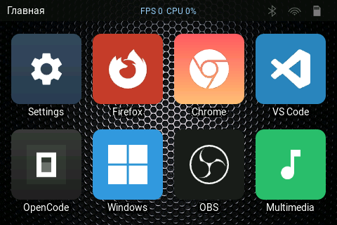

# ModiPAD

Сенсорная клавиатура на **ESP32-S3** с 3.5-дюймовым сенсорным дисплеем **JC3248W535EN** (480x320, QSPI-панель **AXS15231B** + ёмкостный тачскрин). Есть страницы на основе JSON, динамические фоны, клиент OBS Studio, полноценный веб-конфигуратор и обновление по OTA.

> **Перед изменением драйверов, пути отрисовки (flush), размещения данных в памяти или раскладки задач по ядрам прочитайте раздел «Критические инварианты» в [Архитектуре](docs/architecture_rus.md#7-критические-инварианты-не-нарушать).** Эти правила являются несущими конструкциями системы; нарушение любого из них уже приводило к жестким, трудноуловимым зависаниям интерфейса.

## Оглавление
1. [Обзор](#1-обзор)
2. [Поддерживаемое устройство](#2-поддерживаемое-устройство)
3. [Возможности](#3-возможности)
4. [Скриншоты](#4-скриншоты)
5. [Начало работы](#5-начало-работы)
6. [Прошивка и обновления](#6-прошивка-и-обновления)
7. [Языки](#7-языки)
8. [Меню start.bat](#8-меню-startbat)
9. [Документация](#9-документация)
10. [Участие](#10-участие)
11. [Лицензия](#11-лицензия)
12. [Благодарности](#12-благодарности)

---

## 1. Обзор

ModiPAD превращает один сенсорный дисплей на ESP32-S3 в настраиваемую сенсорную клавиатуру. Сенсорные кнопки отправляют горячие клавиши, текст, макросы, мультимедийные клавиши и команды OBS Studio. Вся раскладка хранится в одном JSON-файле, который редактируется из встроенного веб-конфигуратора. Устройство также может работать точкой доступа Wi-Fi, пультом OBS и клавиатурой Bluetooth LE HID. Хост-приложение не требуется — настройка из любого браузера.

Прошивка — приложение на базе **ESP-IDF 5.3.1**, собираемое с помощью PlatformIO. Драйверы дисплея/тача AXS15231B и порт LVGL основаны на референсных проектах вендора и адаптированы для ESP-IDF вместо Arduino. Текущая версия — **5.3.6** (`MODIPAD_FIRMWARE_VERSION` в `src/config.h`).

---

## 2. Поддерживаемое устройство

Проект рассчитан и оптимизирован под одно устройство — модуль **JC3248W535EN** (плата с 3.5-дюймовым IPS-тачскрином на ESP32-S3). Сторонние компоненты не требуются.

| Компонент | Характеристики |
|-----------|----------------|
| Модуль | **JC3248W535EN** — плата с 3.5-дюймовой IPS-панелью |
| МК | ESP32-S3, двухъядерный Xtensa LX7 @ 240 МГц, Wi-Fi + BLE 5 |
| Flash | 16 МБ, QIO @ 80 МГц |
| PSRAM | 8 МБ octal (OPI) @ 80 МГц, ECC включен |
| Дисплей | 3.5-дюймовая IPS, 320x480 (портрет), контроллер **AXS15231B**, QSPI (4 линии данных); UI выводится повёрнутым в ландшафт 480x320 |
| Тачскрин | Емкостный, контроллер **AXS15231B**, I2C (адрес `0x3B`, 400 кГц) |
| Подсветка | GPIO1, управление яркостью через PWM |
| USB | Нативный ESP32-S3 USB-Serial-JTAG (прошивка и логи, виден как COM-порт) |
| Хранилище | microSD через SDMMC 1-bit (опционально, для дополнительных медиа) |

Экран — 3.5-дюймовая IPS-панель (контроллер AXS15231B) с интерфейсом QSPI. Поскольку панель поддерживает только полную перерисовку, драйвер работает с `full_refresh = 1`, а ландшафтный вид получается программным поворотом (см. [Архитектура](docs/architecture_rus.md) 1.4). Полная распиновка и подключение — в [Архитектуре](docs/architecture_rus.md) 11.

---

## 3. Возможности

* **Настраиваемые сенсорные страницы.** Каждая страница — это сетка сенсорных кнопок. Кнопка может показывать иконку или текст.
* **Действия кнопок.** Кнопка отправляет горячую клавишу, текст, макрос или мультимедийную клавишу. Также может отправить команду OBS Studio, открыть другую страницу или настройки.
* **Сенсорное управление.** Коснитесь кнопки, чтобы нажать её. Свайп влево/вправо — смена страницы. Свайп вниз — главная страница. Свайп вверх — приглушение экрана.
* **Вывод по Bluetooth.** Устройство отправляет клавиши как клавиатура Bluetooth LE HID, включая мультимедийные.
* **Wi-Fi.** Устройство может работать точкой доступа Wi-Fi для веб-конфигуратора или клиентом Wi-Fi для связи с OBS Studio.
* **Настройки на устройстве.** Режим радио, яркость, звук кнопок, Wi-Fi, OBS, таймаут сна, резервная копия конфига и обновление прошивки.
* **Веб-конфигуратор.** Редактирование страниц и кнопок, управление изображениями, предпросмотр, просмотр логов, резервные копии и загрузка прошивки.
* **Дублирование страниц и стилей.** В веб-конфигураторе кнопка **Дублировать** создаёт полную копию страницы (включая главную) и стиля; к имени копии через пробел добавляется `1`.
* **Экран «Проблемы».** Плитка **Настройки → Проблемы** на устройстве показывает диагностику при загрузке: отсутствие/заполненность SD-карты, повреждённый конфиг и отсутствующие файлы (проверка отсутствующих файлов охватывает только внутренний LittleFS — SD-карта является необязательным внешним источником).
* **Два языка.** Русский и английский на экране и в веб-конфигураторе.
* **Простое хранение.** Вся раскладка — один JSON-файл. Хост-приложение не нужно.
* **Статус-бар.** Показывает имя текущей страницы, индикаторы Bluetooth/Wi-Fi и SD-карты (и, при желании, FPS/CPU).
* **Обновления.** Прошивка по Wi-Fi (OTA) или с SD-карты.
* **Загрузка и сон.** Экран заставки при старте и таймаут отключения экрана.

Описание каждого окна — в [Интерфейсе](docs/interface_rus.md). Внутреннее устройство — в [Архитектуре](docs/architecture_rus.md).

---

## 4. Скриншоты

Все страницы/вкладки прошивки и все разделы веб-конфигуратора собраны с описанием в **[docs/screenshots](docs/screenshots/README_RUS.md)**.

---

## 5. Начало работы

### Требования

- **PlatformIO Core** (`pip install -U platformio` или расширение PlatformIO IDE для VS Code) — при первой сборке автоматически скачиваются инструментарий Espressif, платформа `espressif32@6.9.0`, ESP-IDF 5.3.1 и managed-компоненты, поэтому у сборки прошивки **нет ручных зависимостей** (полностью портативна).
- Опционально: **MinGW GCC** (ПК-симуляторы), **Node.js + `lv_font_conv`** (перегенерация шрифтов), **Python 3** (веб-превью и скрипты в `tools/`). Файлы для разработки SDL2 уже лежат в `tools/sdl2/`.
- Windows 10/11 (или драйвер для нативного USB на старых Windows — см. ниже).

### Windows: драйвер COM-порта

Устройство определяется как **COM-порт через нативный USB ESP32-S3** (USB-Serial-JTAG, USB ID `303A:1001`).

- **Windows 10 / 11** — драйвер не нужен: порт привязывается автоматически как «USB Serial Device (COMx)». Подключите плату и проверьте Диспетчер устройств → Порты (COM и LPT).
- **Windows 7 / 8.1** — встроенный драйвер не распознаёт нативный USB-Serial-JTAG. Установите драйвер **USB-serial (CDC)** либо используйте UART-порт платы через USB-UART-мост и установите драйвер моста (**CH340/CH34x** от WCH или **CP210x** от Silicon Labs).
- Используйте USB-**данные** (не только зарядка) в USB-порту модуля.

### Установка

1. Установите **PlatformIO Core** и подключите устройство по USB; запомните COM-порт.
2. `pio run -t upload` — прошивка прошивки.
3. `pio run -t uploadfs` — прошивка образа LittleFS (`datadevice/`: конфиг, изображения, веб-интерфейс, шрифты).
4. Опционально: запустите `scripts\sync_sd.bat`, чтобы скопировать `datasdcard/modipad` на microSD.
5. Перезагрузите устройство. Чтобы открыть веб-конфигуратор: Настройки → Режим → **Wi-Fi точка доступа**, перезагрузка, подключение к сети `ModiPAD_Setup` (пароль `12345678`) и открыть `http://192.168.4.1`.

Либо один раз запустите **`start.bat`** и выберите пункт **6** (прошивка + внутреннее хранилище); пункт **7** копирует SD-карту (см. ниже).

---

## 6. Прошивка и обновления

Есть несколько независимых способов прошить или обновить устройство. Образ прошивки — `.pio/build/modipad/firmware.bin`, образ внутренней ФС — `.pio/build/modipad/littlefs.bin`; каждая сборка также архивируется в `firmware/<version>/` скриптом `extra_script.py` (`firmware_<version>_<stamp>.bin` и `littlefs_<version>_<stamp>.bin` рядом).

### Через веб-страницу (OTA)

В веб-конфигураторе откройте **Устройство → Обновление прошивки**:

- **Загрузить .bin** отправляет образ в `POST /api/ota`; устройство пишет его в неактивный OTA-слот и перезагружается в него (с откатом загрузчика при неудачном старте).
- **Обновить с SD** отправляет `POST /api/ota/sd` и прошивает заранее подготовленный образ с карты (см. ниже).

Кабель не нужен — только браузер и устройство в одной сети Wi-Fi. Не отключайте питание во время обновления.

### С SD-карты

1. Скопируйте образ прошивки в корень карты под именем `update.bin`.
2. Вставьте карту и откройте на устройстве **Настройки → Система → Обновить с SD** (также доступно кнопкой **Устройство → Обновить с SD** в вебе).

Устройство прошивает образ с карты и перезагружается. На карте также могут храниться резервные копии конфига (см. ниже).

### Через COM-порт (start.bat)

При подключённой по USB плате используйте `start.bat` (или напрямую `pio`). Сборка и заливка — отдельные пункты меню:

- `start.bat` → **1** `pio run` / **2** `pio run -t buildfs` / **3** оба — собрать прошивку / внутренний LittleFS / и то и другое. Ничего не прошивается.
- `start.bat` → **4** `pio run -t upload` — залить только прошивку.
- `start.bat` → **5** `pio run -t uploadfs` — залить только внутренний LittleFS (конфиг, изображения, веб-интерфейс, шрифты).
- `start.bat` → **6** `pio run -t upload` + `pio run -t uploadfs` — прошивка + внутренний LittleFS.
- `start.bat` → **7** — копирование медиа на SD-карту (карта должна быть извлечена из устройства и вставлена в картридер ПК).

### Резервные копии конфигурации

Это резервные копии **конфигурации**, а не прошивки:

- Устройство: **Настройки → Система** — сохранить текущий конфиг на SD-карту или импортировать с неё (`/sdcard/modipad/config/backup_<version>_<n>.json`).
- Веб: **Скачать / Восстановить / Сохранить на SD** на странице «Основные» (`/api/config`, `/api/backup/*`).
- Тот же `config.json` можно положить прямо на SD-карту и импортировать на устройстве.

### Создание страниц (веб-конфигуратор)

Вся раскладка — это один JSON-файл (`config.json`); веб-конфигуратор редактирует его, но можно править и вручную.

1. Откройте конфигуратор — страницу самого устройства (`ModiPAD_Setup` → `http://192.168.4.1`) или локальное превью (см. **Г** ниже).
2. Вкладка **Страницы** → **+ Добавить страницу**. Специальная страница **Главная** всегда первая и не удаляется; имя любой страницы меняется в её карточке.
3. Вкладка **Кнопки** → выберите цель в списке **Страница:**, задайте **матрицу** кнопок (строки × столбцы) и фон страницы, затем щёлкните ячейку в предпросмотре, чтобы открыть редактор кнопки.
4. В редакторе задайте **содержимое** (иконка или текст), форму/фон/рамку и **действие**: `hotkey` (`CTRL+C`, `GUI+L`, …), `text`, `macro`, `multimedia`, `obs` или переход на страницу (`target_page`; для Главной — `__HOME__`). Нажмите **Сохранить**.
5. Повторите для всех ячеек и страниц; для точной проверки используйте **Предпросмотр**.
6. Сохранение происходит автоматически (`POST /api/config`); большинство изменений появляется после **перезагрузки**.

Полная схема `config.json` — в [Интерфейсе](docs/interface_rus.md) 3.

### Как залить конфиг в устройство

Устройство читает раскладку из `/littlefs/config.json`. Любой из способов ниже кладёт конфиг туда:

**А — Веб-конфигуратор (устройство онлайн, без кабеля)**
1. Переведите устройство в режим **Wi-Fi AP** и откройте `http://192.168.4.1`.
2. Редактируйте — каждое сохранение пишет `/littlefs/config.json` прямо на устройстве.
3. Нажмите **Перезагрузить** (`POST /api/reload`), чтобы применить.

**Б — Перепрошить внутреннюю файловую систему (кабель USB)**
1. Положите конфиг в `datadevice/config.json` (сборка упаковывает `datadevice/` в LittleFS; локальное превью пишет именно сюда).
2. `pio run -t uploadfs` или `start.bat` → **5** *Flash storage*. (Пункт **3** собирает прошивку и LittleFS без заливки; **6** собирает и заливает оба.)
3. Перезагрузите устройство.

**В — Восстановление JSON с microSD-карты**
1. Скопируйте JSON в папку карты `\modipad\config\` (источник в репозитории: `datasdcard/modipad/config/`; развернуть — `scripts\sync_sd.bat`, пункт **7**). Все `*.json` оттуда попадают в список.
2. На устройстве: **Настройки → Система → Импорт**; либо в вебе: **Система → Резервные копии → Восстановить**.
3. Перезагрузите, чтобы применить.

**Г — Из эмулятора веб-страницы на Windows (устройство не нужно)**
1. `start.bat` → **13** *Web UI preview* или `scripts\run_web_preview.bat`. Поднимает тот же интерфейс на `http://127.0.0.1:8765/` и сохраняет в файлы репозитория.
2. Каждое сохранение пишет **`datadevice/config.json`** и зеркалирует копию в **`datasdcard/modipad/config/backup_preview.json`** (сервер печатает оба пути).
3. Примените результат способом **Б** (перепрошивка `datadevice/`) или **В** (импорт с карты).

> Кнопка **Скачать** в вебе сохраняет текущий `config.json` устройства; положите его в `datasdcard/modipad/config/` (или сразу в `\modipad\config\` на карте), чтобы восстановить позже.

---

## 7. Языки

Интерфейс поставляется на двух языках:

- **Английский** и **русский** для интерфейса устройства (экрана) — строки в `src/i18n.c`.
- **Английский** и **русский** для веб-конфигуратора — JSON-файлы в `datadevice/web/locales/` (`en.json`, `ru.json`).

Язык веб-интерфейса выбирается из `localStorage` (с откатом к языку браузера) и переключается в заголовке; язык устройства — настройка на странице **Общие**.

**Добавление нового языка веб-интерфейса (без перепрошивки):**

1. Скопируйте `datadevice/web/locales/en.json` в `datadevice/web/locales/<код>.json` и переведите значения (ключи оставьте).
2. Добавьте для него кнопку в `datadevice/web/index.html` рядом с существующими `RU`/`EN` (`onclick="changeLanguage('<код>')"`).
3. Скопируйте обновлённые файлы на устройство (`start.bat` → **5** Flash storage, или синхронизируйте карту) и перезагрузите браузер.

**Добавление нового языка устройства (экрана)** дополнительно требует перевода таблиц в `src/i18n.c` и пересборки прошивки и шрифтов Roboto (`start.bat` → **17**, затем сборка). Подробности — в [Интерфейсе](docs/interface_rus.md) 2.

---

## 8. Меню start.bat

`start.bat` — единая корневая точка входа; он открывает нумерованное меню, пункты которого запускают скрипты из `scripts/`.

В первой колонке — название пункта точно как в файле.

| Пункт меню | Что делает |
|------------|------------|
| `1. Build firmware` | Собирает прошивку (`pio run`). Ничего не прошивается; архивируется в `firmware/<version>/`. |
| `2. Build storage` | Собирает образ внутреннего LittleFS (`pio run -t buildfs`) из `datadevice/`. Ничего не прошивается; образ кладётся рядом с прошивкой. |
| `3. Build firmware + storage` | Собирает и прошивку, и внутреннее хранилище (пункты 1 и 2). |
| `4. Flash firmware` | Прошивает прошивку по USB. |
| `5. Flash storage` | Прошивает только внутренний LittleFS (`uploadfs`). Нужен после правок веб-интерфейса или конфига. |
| `6. Flash firmware + storage` | Прошивает прошивку и внутренний LittleFS. |
| `7. Upload SD card` | Копирует `datasdcard/modipad` на карту microSD (папка `\modipad`). Карта должна быть в картридере ПК. |
| `8. Serial monitor` | Открывает последовательный монитор на 115200. |
| `9. Open Web UI` | Открывает `http://192.168.4.1`. Устройство должно быть в режиме Wi-Fi AP. |
| `10. Clean project` | Удаляет `.pio` (кеш сборки и зависимостей). |
| `11. Emulator: SDL2` | Запускает симулятор интерфейса в окне SDL2. Нужен `tools\sdl2\bin\SDL2.dll`. |
| `12. Emulator: Win32` | Запускает симулятор интерфейса на Win32 API. DLL не нужен. |
| `13. Web UI preview` | Открывает редактор конфига в браузере. Сохраняет в `datadevice\config.json`. Для устройства используйте пункт `5`. |
| `14. Generate images` | Генерирует PNG-библиотеку и сжимает её без потерь. |
| `15. Optimize PNG - lossless` | Сжимает PNG без потери качества. |
| `16. Optimize PNG - max lossy` | Сжимает PNG с потерей качества. |
| `17. Generate fonts` | Генерирует шрифты 10/12/14/16/18 и bold через `lv_font_conv`. |
| `18. Compress SD backgrounds` | Сжимает фоны на SD-карте. |
| `0. Выход` | Выход из меню. |

Каждый скрипт сам находит `pio` в `PATH` (или `%USERPROFILE%\.platformio\penv\Scripts\pio.exe`), работает из корня проекта и ждёт нажатия клавиши в конце. Подробное описание каждого скрипта и дополнительных скриптов, которых нет в меню, — в [Архитектуре](docs/architecture_rus.md) 12.

---

## 9. Документация

- **[Архитектура](docs/architecture_rus.md)** — задачи и ядра, модель памяти, хранение, зависимости, структура проекта, распиновка платы, скрипты сборки, диагностика, критические инварианты, ПК-симулятор, антипаттерны, устранение неполадок.
- **[Интерфейс](docs/interface_rus.md)** — интерфейс устройства и жесты, `config.json` / `settings.json`, веб-конфигуратор, библиотека ресурсов.
- **[Скриншоты](docs/screenshots/README_RUS.md)** — все страницы/вкладки прошивки и все разделы веб-конфигуратора.
- **[Лицензия](docs/LICENSE)** — MIT.

English versions: [README.md](README.md), [docs/architecture.md](docs/architecture.md), [docs/interface.md](docs/interface.md), [docs/screenshots/README.md](docs/screenshots/README.md).

---

## 10. Участие

Вклад приветствуется:

- **Отчёты об ошибках** — создайте issue с шагами воспроизведения и, если возможно, логом `HEARTBEAT` и выводом `/api/log`.
- **Запросы функций** — опишите сценарий использования в issue.
- **Pull request** — перед изменением драйверов, пути отрисовки (flush), размещения в памяти или раскладки задач по ядрам прочитайте **Критические инварианты** в [Архитектуре](docs/architecture_rus.md#7-критические-инварианты-не-нарушать).

---

## 11. Лицензия

Проект распространяется под лицензией **MIT**. Полный текст — в [docs/LICENSE](docs/LICENSE).

---

## 12. Благодарности

- [LVGL](https://lvgl.io/) — графическая библиотека (MIT).
- [ESP-IDF](https://github.com/espressif/esp-idf) — Espressif IoT Development Framework (Apache-2.0).
- [joltwallet/littlefs](https://github.com/joltwallet/esp_littlefs) — компонент LittleFS.
- [cJSON](https://github.com/DaveGamble/cJSON) — парсер JSON.
- Драйвер панели/тача AXS15231B происходит из вендорского демо JC3248W535EN (`DEMO_LVGL`).
- [Roboto](https://fonts.google.com/specimen/Roboto) — шрифты интерфейса (Apache-2.0).
- [SDL2](https://www.libsdl.org/) — используется только ПК-симулятором.
