# Screenshots

**Русский:** [README_RUS.md](README_RUS.md)

Every screen of the project: the firmware UI (captured from the PC simulator, but these are the real 480x320 device frames) and the full pages of the web configurator.

- [Firmware (device)](#firmware-device)
- [Web configurator](#web-configurator)

> The device frames come from the simulator (`[12] Emulator: Win32`), which compiles the same `src/` sources as the firmware, so they match the device screen pixel for pixel. The web pages are captured from the local preview server (`[13] Web UI preview`).

---

## Firmware (device)

### Main page
Launcher: a grid of tiles with app icons and a top status bar (page name, Bluetooth/Wi-Fi/SD indicators and, optionally, FPS/CPU). Swipe left/right switches pages, swipe down returns to the main page, swipe up dims the brightness.

### Custom pages

| Page | Description |
|------|-------------|
| [Windows](device/page-windows.png) | Windows shortcuts |
| [Firefox](device/page-firefox.png) | Browser shortcuts |
| [Chrome](device/page-chrome.png) | Chrome shortcuts |
| [VS Code](device/page-vscode.png) | Editor commands |
| [OpenCode](device/page-opencode.png) | OpenCode commands |
| [Multimedia](device/page-multimedia.png) | Playback control |
| [OBS Studio](device/page-obsstudio.png) | OBS recording control |

  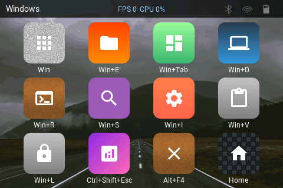
  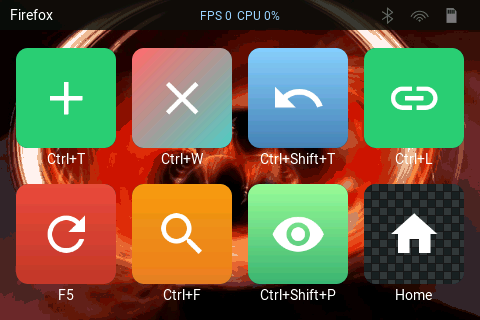
  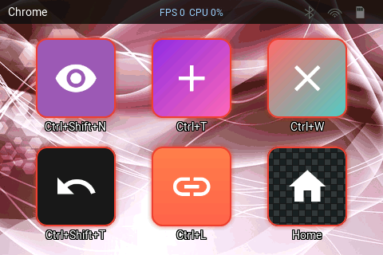

  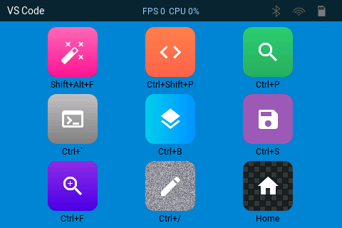
  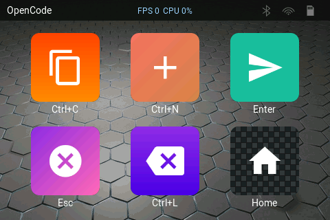
  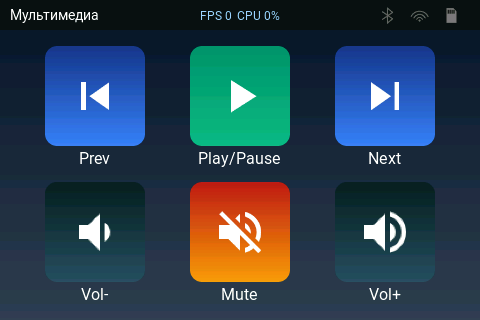

  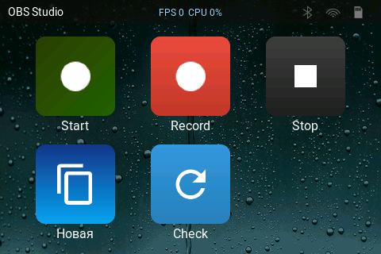

### Settings

| Screen | Description |
|--------|-------------|
| [Settings menu](device/settings-menu.png) | Section tiles: Mode, OBS, General, Configuration, System, About, Problems |
| [Mode](device/settings-mode.png) | Radio choice: BLE keyboard / Wi-Fi access point / Wi-Fi client |
| [OBS](device/settings-obs.png) | OBS WebSocket host, port and password |
| [General](device/settings-general.png) | Brightness, language, key sound, sleep timeout, caption font, button style |
| [Configuration](device/settings-configuration.png) | Bluetooth device name, Wi-Fi AP and Wi-Fi client parameters |
| [System](device/settings-system.png) | Config backup/restore on SD, firmware update |
| [About](device/settings-about.png) | Hardware, versions (LVGL/IDF), system information, task stacks |
| [Problems](device/settings-problems.png) | Boot diagnostics: SD card, damaged config, missing files (internal FS only) |

  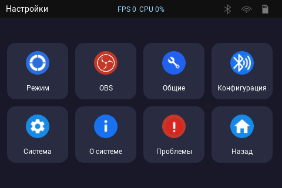
  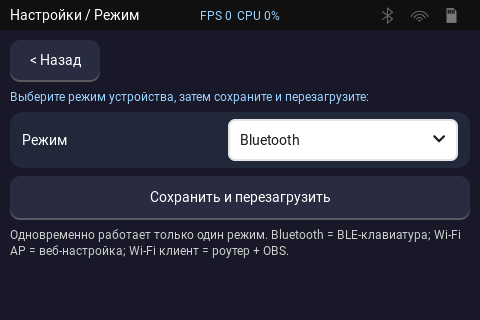
  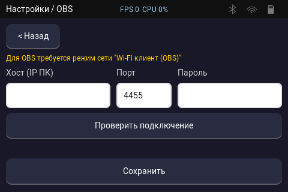

  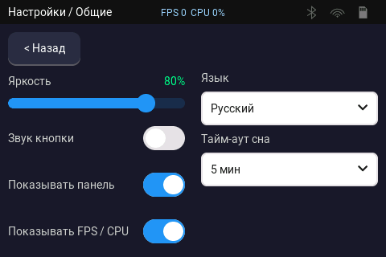
  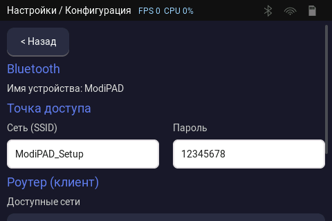
  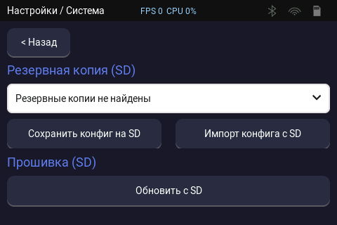

  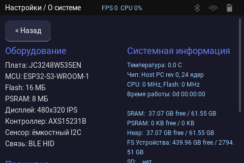
  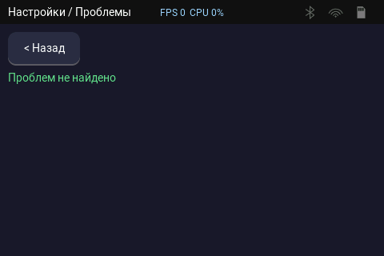

---

## Web configurator

Open it from a browser (the device address `http://192.168.4.1` in access-point mode, or the local preview server). Below are all sections of the top navigation.

### System
Brightness, key sound, sleep timeout, device mode, Bluetooth (the device name shown to Windows is editable), Wi-Fi access point, Wi-Fi client (OBS), OBS and config backups.

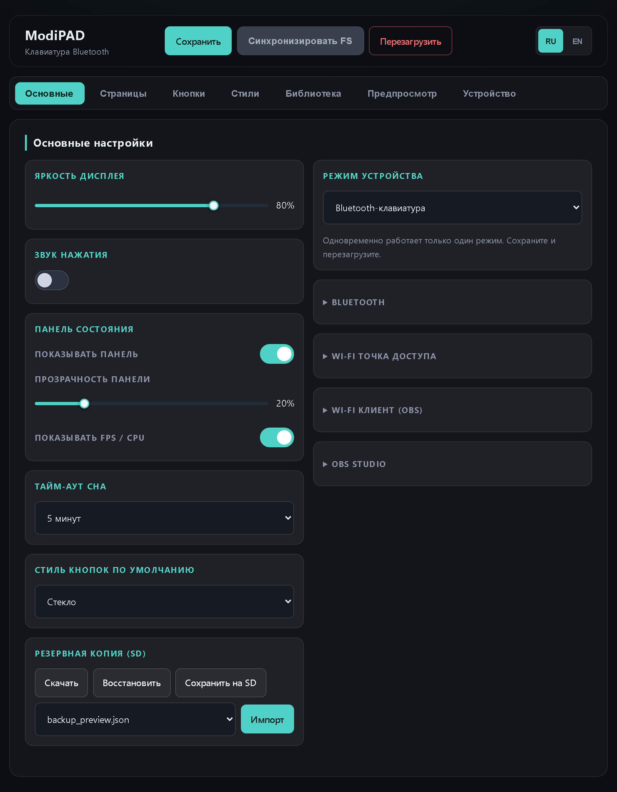

### Pages
List, create, rename, edit and delete pages; pick the main page. **Duplicate** makes a full copy of a page (the Main page included; the name gets a trailing `1`).

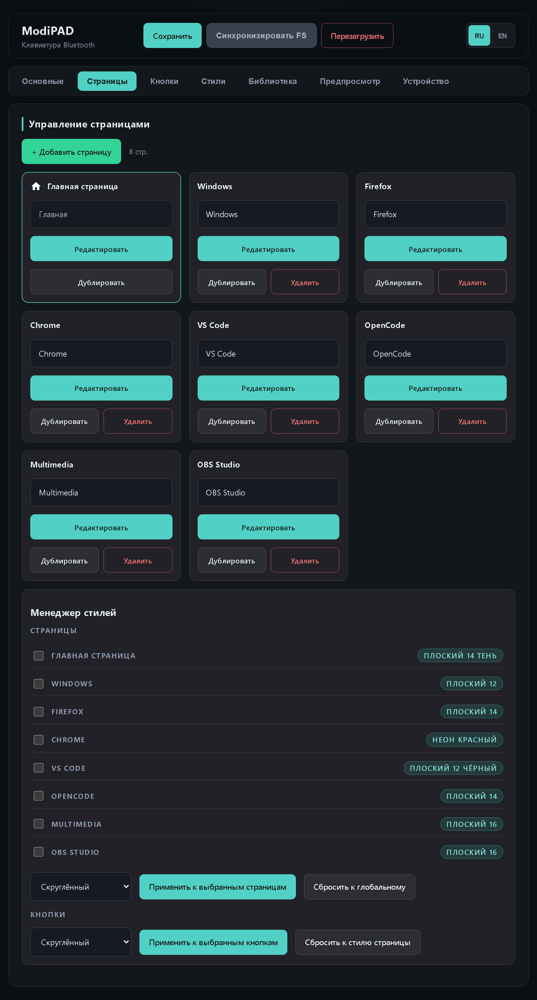

### Buttons
Button editor: action (hotkey/text/macro/page/multimedia/OBS), icon, background, caption, page grid and an interactive preview. **Paste** replaces the open button's settings; **Duplicate** creates a new button.

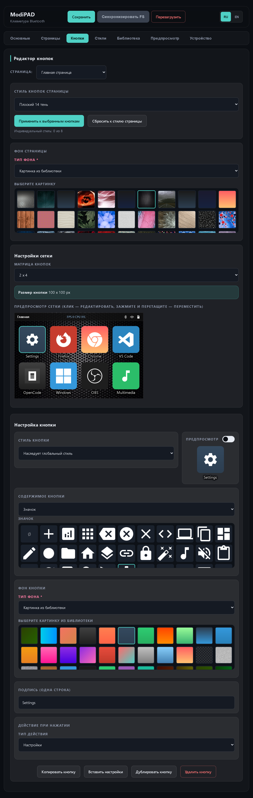

### Styles
Button appearance presets (radius, border, shadow, button/caption text) with a live preview. A preset can be duplicated (copy named `<name> 1`) or deleted.

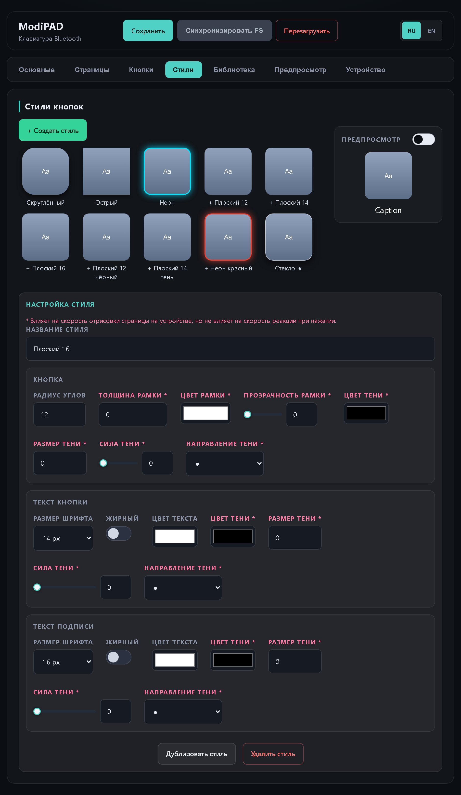

### Library
Device and SD-card image library: upload, delete, categories.

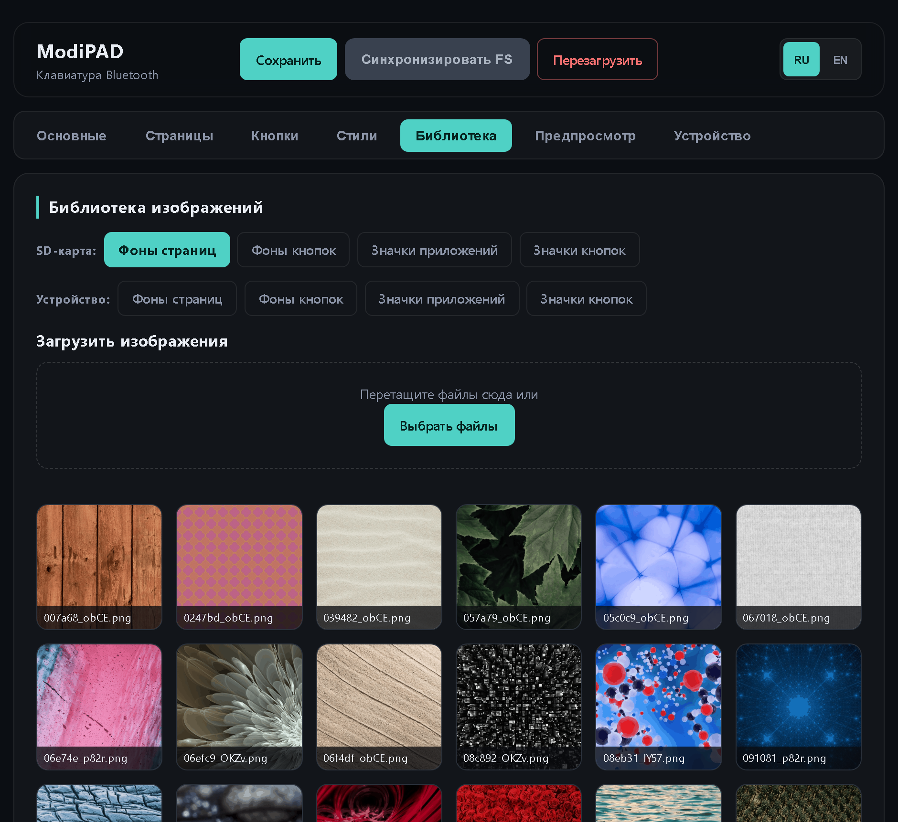

### Preview
Device-like page preview (status bar, backgrounds, icons, captions). Text-content buttons render their label with the style's text settings.

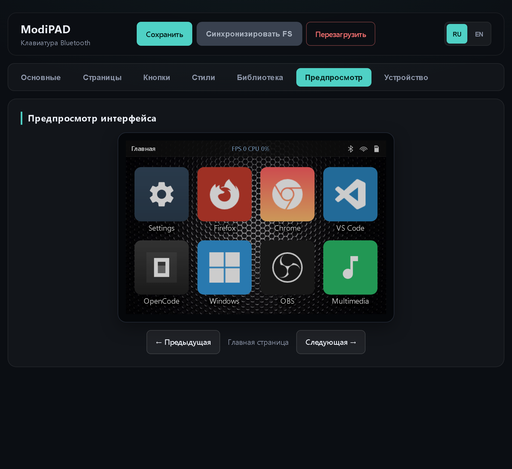

### Device
Hardware, versions (firmware/build/LVGL/IDF), full system information (temperature, memory, filesystems, SD, MACs, task stacks), firmware update and the diagnostics log - the same parameters as the firmware "About" screen.

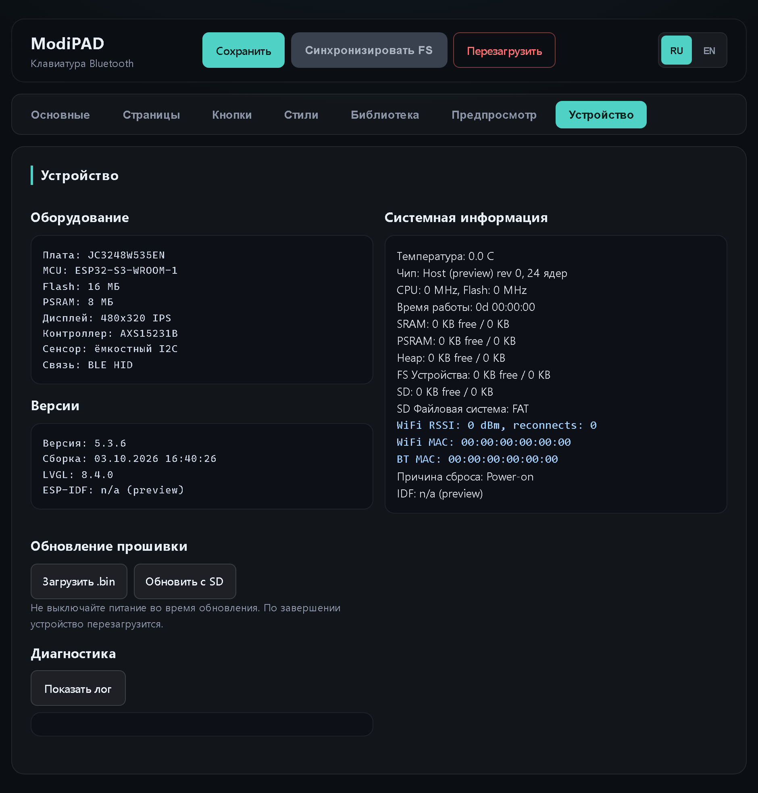
